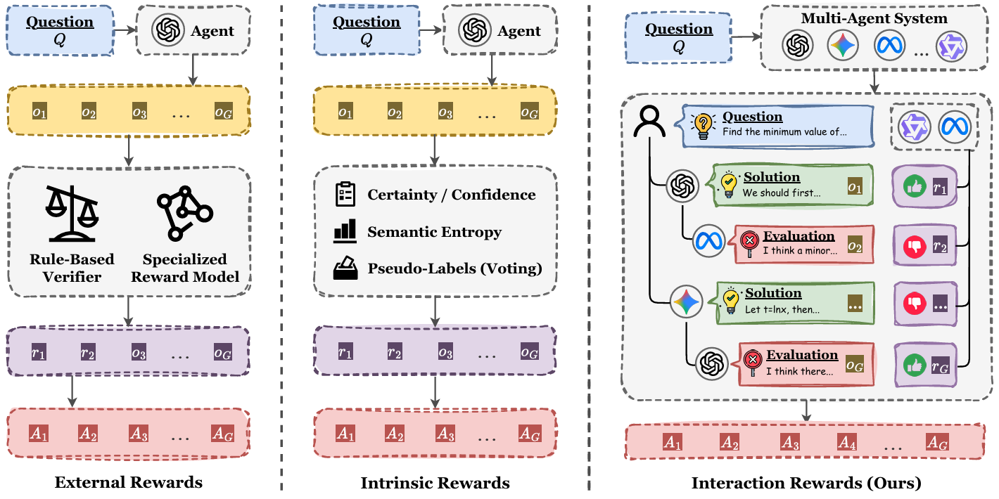

<h1 align="center">
    CoMAS: Co-Evolving Multi-Agent Systems via Interaction Rewards
</h1>

<p align="center">
    Implementation for the paper "CoMAS: Co-Evolving Multi-Agent Systems via Interaction Rewards".
</p>

<p align="center">
    <a href="https://arxiv.org/abs/2510.08529"> </a>
    <a href="https://github.com/xxyQwQ/CoMAS"> </a>
</p>



Self-evolution is a central research topic in enabling large language model (LLM)-based agents to continually improve their capabilities after pretraining. Recent research has witnessed a transition from reinforcement learning (RL)-free to RL-based methods. Inspired by the self-evolution mechanisms observed in human intelligence, we introduce **Co**-Evolving **M**ulti-**A**gent **S**ystems (CoMAS), a novel framework that enables agents to improve autonomously by learning from inter-agent interactions without external supervision. CoMAS generates intrinsic rewards from rich discussion dynamics, employs an LLM-as-a-judge mechanism to formulate these rewards, and optimizes each agent's policy through RL, thereby enabling decentralized and scalable co-evolution.

## 📰 News

- **[2025/10/10]** Our code implementation is released on [GitHub](https://github.com/xxyQwQ/CoMAS).
- **[2025/10/10]** The initial version of our paper is submitted to [arXiv](https://arxiv.org/abs/2510.08529).

## ⚙️ Configuration

Clone the repository and navigate to the directory:

```bash
git clone https://github.com/xxyQwQ/CoMAS
cd CoMAS
```

Create a conda environment and install the dependencies:

```bash
conda create -n comas python=3.10
conda activate comas
pip install -r requirements.txt
```

Feel free to adjust the version of dependencies if necessary.

## 🚀 Training

Run the following commands to conduct CoMAS training:

```bash
conda activate comas
bash scripts/train_comas.sh
```

The training logs, intermediate checkpoints, together with saved models will be saved in the `saves` folder.

Before training, you should carefully configure the parameters.
- It is necessary to modify the model paths and wandb settings.
- For A100 GPUs with 80GB memory, it is recommended to use 2 GPUs for each agent.
- Choose an appropriate micro batch size to avoid out-of-memory errors.

## 📊 Evaluation

Run the following commands to evaluate the model:

```bash
conda activate comas
bash scripts/evaluate_model.sh [model_name] [model_path]
```

The evaluation results will be saved in the `results` folder.

Remember to replace `[model_name]` and `[model_path]` with your own settings.

## 📜 Citation

Please consider citing our paper if you find it helpful:

```bibtex
@article{xue2025comas,
  title={CoMAS: Co-Evolving Multi-Agent Systems via Interaction Rewards},
  author={Xue, Xiangyuan and Zhou, Yifan and Zhang, Guibin and Zhang, Zaibin and Li, Yijiang and Zhang, Chen and Yin, Zhenfei and Torr, Philip and Ouyang, Wanli and Bai, Lei},
  journal={arXiv preprint arXiv:2510.08529},
  year={2025}
}
```
